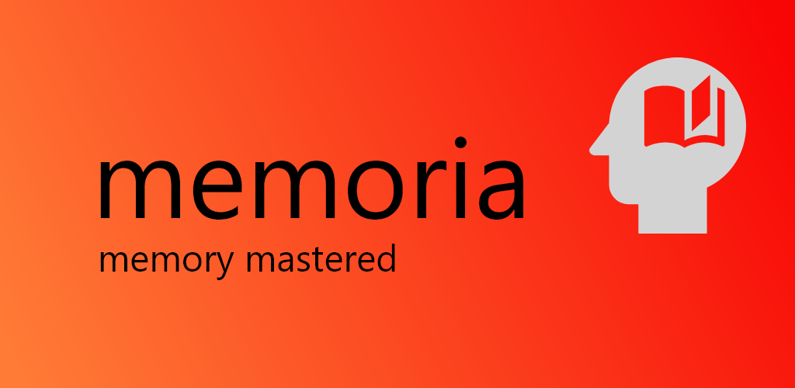
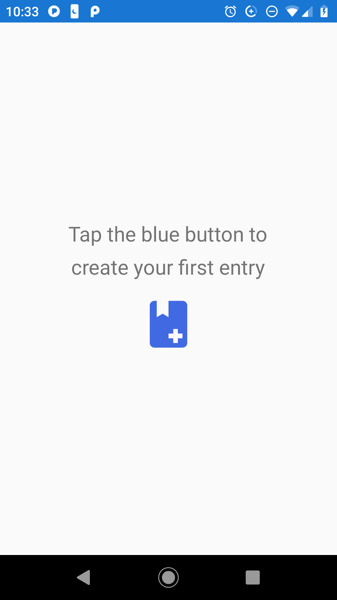
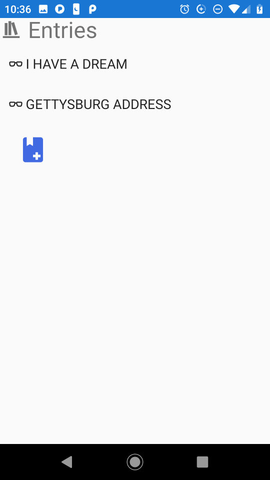
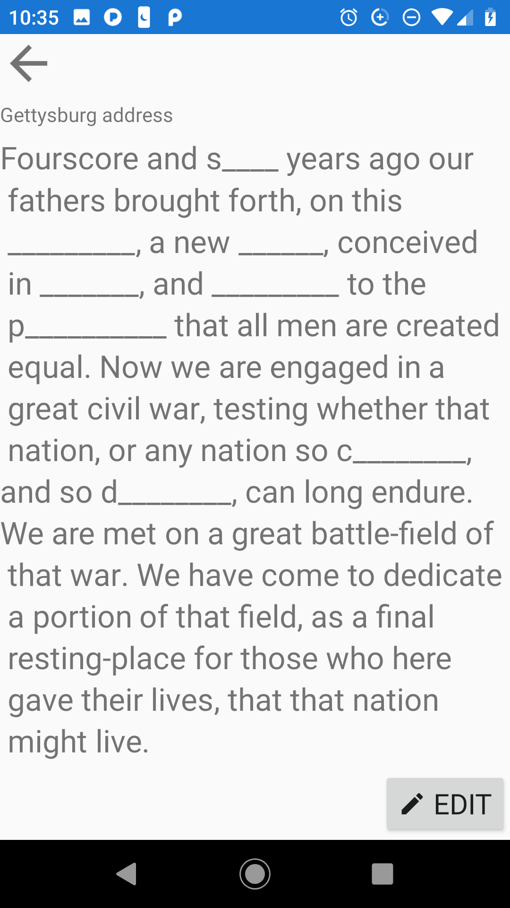

# memoria

A mobile app for memorizing text passages.

Built using F# and [Fabulous](https://github.com/fsprojects/Fabulous). 

The app stores a collection of text entries. It helps with memorization by hiding progressively more of the text to be memorized until the full passage has been committed to memory.

Available on the play store.
[Play Store](https://play.google.com/store/apps/details?id=memoria.domina)

### Screenshots

